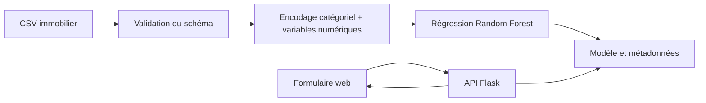

# Berkane Immo ML

**Prototype transparent de régression des prix immobiliers à Berkane, Maroc.**

[English version](README.md)

Berkane Immo ML améliore un mini-projet web académique avec une chaîne de machine learning reproductible. Le dépôt associe une interface web responsive, une API JSON Flask, une validation stricte des entrées et un pipeline Random Forest avec scikit-learn.

> **Information sur les données :** les données incluses sont synthétiques et servent uniquement à démontrer le fonctionnement du logiciel. Elles ne représentent pas des transactions vérifiées à Berkane. Les sorties ne constituent pas une expertise immobilière.


## Pourquoi cette version existe

Le site d’origine présentait des exemples de prix sans contenir de modèle prédictif. Cette version :

- retire les affirmations non vérifiées sur les prix moyens et la précision ;
- retire les fausses pages de connexion et d’inscription ;
- remplace les prix codés en dur par des scénarios d’entrée clairement identifiés ;
- ajoute une chaîne complète données → entraînement → modèle → API → interface ;
- enregistre si le modèle utilise des données réelles ou synthétiques ;
- retourne une plage indicative fondée sur la MAE de validation.

## Architecture



## Variables du modèle

| Groupe | Variables |
|---|---|
| Localisation | Quartier |
| Bien | Type, état, surface, étage et ancienneté |
| Capacité | Chambres et salles de bain |
| Équipements | Balcon, jardin, garage et climatisation |
| Cible | Prix du bien en MAD |

Les variables catégorielles sont encodées dans le pipeline sauvegardé. La Random Forest utilise 300 arbres, `min_samples_leaf=2` et `random_state=42`. Une séparation fixe 80/20 calcule la MAE, la RMSE et le R² dans `models/metrics.json`.

## Lancer la démonstration synthétique

Python 3.11 ou une version plus récente est recommandé.

```bash
python -m venv .venv
# Windows : .venv\Scripts\activate
# macOS/Linux : source .venv/bin/activate
pip install -r requirements.txt

python -m scripts.generate_demo_data
python -m ml.modeling \
  --data data/demo_properties.csv \
  --model models/berkane_price_model.joblib \
  --metrics models/metrics.json \
  --data-kind synthetic-demo

python app.py
```

Ouvrez `http://127.0.0.1:5000/estimation.html`.

L’interface affiche un avertissement lorsque les métadonnées indiquent `synthetic-demo`. Utilisez `--data-kind real` uniquement avec des observations réelles, autorisées et correctement documentées.

## Tests

```bash
python -m unittest discover -s tests -v
```

Les tests couvrent la validation des entrées, le cycle entraînement/prédiction, l’absence du modèle et le point d’accès Flask. GitHub Actions exécute la même suite après chaque push et pull request.

## Limites actuelles

- Les données synthétiques valident le logiciel, pas le marché immobilier local.
- Une plage fondée sur la MAE n’est pas un intervalle de confiance calibré.
- Un système réel nécessite des transactions récentes, représentatives et utilisables légalement.
- Le décalage des données, la couverture des quartiers et les biens atypiques doivent être surveillés.
- La page de contact est une démonstration visuelle et n’envoie aucun message.

## Crédits

Le site académique d’origine a été créé par **ALLAOUI Yassine** et **EL AAMRI Ayoub**. Ce fork conserve son historique et ses crédits. L’extension machine learning, l’intégration API, la validation et la documentation sont maintenues dans ce dépôt par **ALLAOUI Yassine**.

## Licence et utilisation

Prototype académique et éducatif. Le modèle de démonstration ne doit pas être utilisé pour une décision financière, un crédit, un investissement ou une expertise immobilière.
