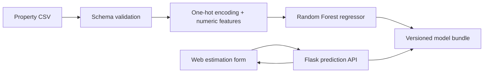

# Berkane Immo ML

**A transparent property-price regression prototype for Berkane, Morocco.**

[Version française](README.fr.md)

Berkane Immo ML upgrades an academic front-end project with a reproducible machine-learning workflow. It combines a responsive web interface, a Flask JSON API, strict input validation and a scikit-learn Random Forest pipeline.

> **Data notice:** this repository includes synthetic data for software demonstration only. It does not contain verified Berkane transactions, and its output is not a professional property valuation.


## Why this version exists

The original website presented example prices but did not contain a predictive model. This version:

- removes unsupported market-average and accuracy claims;
- removes the simulated login and registration pages;
- replaces hard-coded example prices with clearly labelled input scenarios;
- adds a complete data → training → model → API → interface path;
- records whether a trained model used real or synthetic data;
- returns an indicative interval based on validation MAE.

## Architecture



## Machine-learning features

| Group | Features |
|---|---|
| Location | District |
| Property | Type, condition, area, floor and age |
| Capacity | Bedrooms and bathrooms |
| Amenities | Balcony, garden, garage and air conditioning |
| Target | Property price in MAD |

Categorical values are one-hot encoded inside the saved pipeline. The Random Forest uses 300 trees, `min_samples_leaf=2`, and `random_state=42`. A fixed 80/20 split reports MAE, RMSE and R² in `models/metrics.json`.

## Run the synthetic demonstration

Python 3.11 or later is recommended.

```bash
python -m venv .venv
# Windows: .venv\Scripts\activate
# macOS/Linux: source .venv/bin/activate
pip install -r requirements.txt

python -m scripts.generate_demo_data
python -m ml.modeling \
  --data data/demo_properties.csv \
  --model models/berkane_price_model.joblib \
  --metrics models/metrics.json \
  --data-kind synthetic-demo

python app.py
```

Open `http://127.0.0.1:5000/estimation.html`.

The interface displays a prominent warning when the model metadata says `synthetic-demo`. Replace the demo CSV with authorized, documented observations and use `--data-kind real` only when that statement is accurate.

## API example

```http
POST /api/predict
Content-Type: application/json

{
  "district": "Centre-ville",
  "property_type": "apartment",
  "condition": "good",
  "area_m2": 95,
  "bedrooms": 3,
  "bathrooms": 2,
  "floor": 2,
  "age_years": 8,
  "balcony": true,
  "garden": false,
  "garage": true,
  "air_conditioning": true
}
```

The response contains the estimate, lower and upper indicative bounds, and the complete model metadata.

## Tests

```bash
python -m unittest discover -s tests -v
```

The tests cover payload validation, an end-to-end train/predict round trip, the missing-model response and the Flask prediction endpoint. GitHub Actions runs the same suite on every push and pull request.

## Repository structure

```text
berkane-immo-ml/
├── app.py                     # Flask API and static-file server
├── ml/
│   ├── config.py              # Feature schema and valid ranges
│   └── modeling.py            # Training, evaluation and inference
├── scripts/
│   └── generate_demo_data.py  # Deterministic synthetic dataset
├── data/
│   └── README.md              # Real-data contract and provenance rules
├── models/                    # Generated model and metrics
├── tests/                     # Model and API tests
├── css/, image/, js/          # Front-end assets
└── *.html                     # English interface pages
```

## Current limitations

- Synthetic rows validate the software path, not the local housing market.
- An error band derived from validation MAE is not a calibrated confidence interval.
- A production system would require recent, representative and legally usable transaction data.
- Dataset shift, neighbourhood coverage, renovation quality and unusual properties need monitoring.
- The contact page is a visual demonstration and does not send or store messages.

## Credits

The original academic website was created by **ALLAOUI Yassine** and **EL AAMRI Ayoub**. This fork preserves the original history and attribution. The machine-learning extension, API integration, validation and documentation are maintained in this repository by **ALLAOUI Yassine**.

## License and use

Academic and educational prototype. No claim is made that the demo model is suitable for financial, lending, investment or appraisal decisions.
